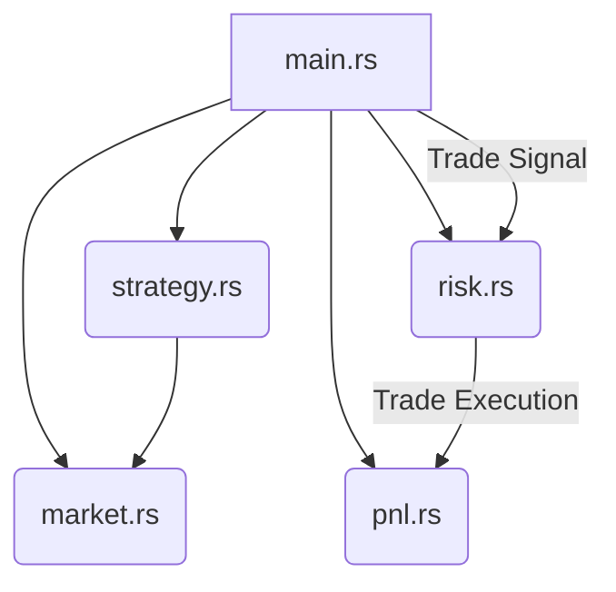
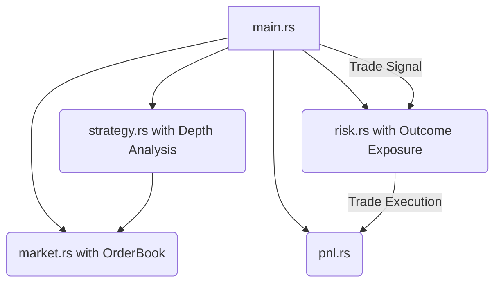

# Architecture Proposal: MPAE Enhancement for Prediction Markets

## 1. Current Architecture

The current Minimum Professional Arbitrage Engine (MPAE) is a synchronous, in-memory simulation of an arbitrage strategy between two exchanges. It is composed of four core modules: `market.rs`, `strategy.rs`, `risk.rs`, and `pnl.rs`.

### 1.1. System Diagram

### 1.2. Module Descriptions

*   **`market.rs`**: Simulates two exchanges, each with a single price point (Top of Book). The price is updated via a random walk.
*   **`strategy.rs`**: Detects arbitrage opportunities based on the Top of Book prices. It does not account for order book depth or prediction market specifics.
*   **`risk.rs`**: Provides basic risk management, checking only for maximum position size and maximum drawdown.
*   **`pnl.rs`**: Tracks the Profit and Loss of the strategy.

## 2. Gaps Identified

Based on the requirements for a "highly skilled" prediction market arbitrage system, the following gaps have been identified in the current architecture:

1.  **No Order Book Simulation**: `market.rs` only simulates a single price, not a full order book. This is a major simplification and does not allow for realistic backtesting of strategies.
2.  **Strategy Lacks Sophistication**: `strategy.rs` is unaware of order book depth, which is critical for calculating slippage and executing larger trades. It also lacks any logic for prediction markets (e.g., binary options).
3.  **Risk Management is Rudimentary**: `risk.rs` is too simplistic. It does not provide the granular risk controls needed for prediction markets, such as exposure limits per outcome.

## 3. Proposed Architecture Update

To address these gaps, we propose a significant enhancement to the MPAE, focusing on a more realistic market simulation and more sophisticated strategy and risk management components.

### 3.1. System Diagram (Proposed)

### 3.2. Detailed Refactoring Plan

#### 3.2.1. `market.rs`: Introduce Order Book Simulation

*   **Objective**: Replace the `TopOfBook` model with a full `OrderBook` simulation.
*   **Changes**:
    *   Create a `Level` struct with `price` and `quantity`.
    *   Create an `OrderBook` struct containing `bids: Vec<Level>` and `asks: Vec<Level>`.
    *   The `Exchange` struct will now contain an `OrderBook`.
    *   Implement a `matching_engine` function in `Exchange` to simulate trade execution and liquidity consumption.

#### 3.2.2. `strategy.rs`: Handle Order Book Depth and Prediction Markets

*   **Objective**: Enhance the strategy to be aware of the order book and the specifics of prediction markets.
*   **Changes**:
    *   The `detect_arbitrage` function will now accept `OrderBook`s as input.
    *   The strategy will analyze the depth of the order book to calculate the volume-weighted average price (VWAP) for a given trade size.
    *   Introduce the concept of `Outcome` (e.g., `Yes`, `No`) for prediction markets. The strategy will now generate signals for specific outcomes.

#### 3.2.3. `risk.rs`: Advanced Risk Controls

*   **Objective**: Implement more granular and sophisticated risk checks.
*   **Changes**:
    *   The `RiskEngine` will now track `exposure_per_outcome`.
    *   A new risk limit, `max_exposure_per_outcome`, will be added.
    *   The `check_trade` function will be updated to validate trades against this new limit.

## 4. Summary of Changes

The proposed changes will transform the MPAE from a simple arbitrage simulator into a more realistic and powerful backtesting engine for prediction market strategies. The introduction of order book simulation, a depth-aware strategy, and more sophisticated risk management will provide a solid foundation for developing and testing advanced arbitrage algorithms. The "No Async" and "Simulated" constraints will be maintained, but the simulation will be far more realistic.
